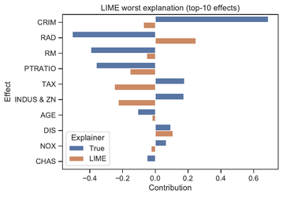
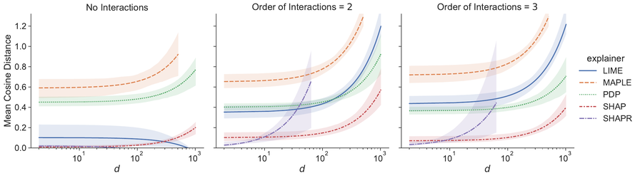

# Post Hoc Explainer Evaluation ToolKit

<!-- https://ecotrust-canada.github.io/markdown-toc/ -->

- [Installation](#installation)
    * [SHAPR Installation](#shapr-installation)
- [Usage](#usage)
    * [Trained Models and Real Data](#trained-models-and-real-data)
    * [Synthetic Models and Data](#synthetic-models-and-data)
        + [Generating Synthetic Expressions](#generating-synthetic-expressions)
        + [Generating Synthetic Data](#generating-synthetic-data)
        + [Evaluating Explainers on the Synthetic Models and Data](#evaluating-explainers-on-the-synthetic-models-and-data)
        + [Aggregating Metrics Across the Explainer Results](#aggregating-metrics-across-the-explainer-results)
        + [Final Notes](#final-notes)
- [Dataset Availability](#dataset-availability)
- [Some Framework-Specific Notes](#some-framework-specific-notes)

This repository provides a toolkit for objectively evaluating post hoc explainers, such as LIME and SHAP. The results
from our papers,
[_How Well Do Feature-Additive Explainers Explain Feature-Additive Predictors?_]() (published) and
[_On the Objective Evaluation of Post Hoc Explainers_](https://arxiv.org/abs/2106.08376) (preprint), were produced using this
codebase. We avoid the need for proxy metrics or subjective evaluation by deriving ground truth feature contributions
from arbitrary models. This is made possible by exploiting existing additive structure, which leaves us with the exact
amount that each effect, comprising one or more features, contributes to the model output. Our proposed algorithm for
fair comparison of model effects and feature attributions by explainers is described in our paper and implemented in
this repository.

This framework allows us to understand the quality of explanations by post hoc explainers. We can visualize quality of
explanations for individual explanations, entire models or datasets, and can directly compare explainers to one another.
For instance, we can easily see poor explanations from LIME for a GAM trained on the Boston Housing regression task:


Or, we can see the effect of the interaction order of effects on explanation quality for multiple explainers over
thousands of synthetic expressions.


**Supported explainers:**

- LIME
- MAPLE
- (Kernel) SHAP
- SHAPR
- PDP
- Blur-IG
- GradCAM
- Gradients x Inputs
- Integrated Gradients
- Occlusion
- Vanilla Gradients
- XRAI

New explainers can be added by subclassing
`posthoceval.explainers._base.BaseExplainer`
and completing the abstract methods. A tutorial may be provided, but in the meantime follow what is done in the classes
in the `posthoceval.explainers.local` module.

**Supported models:**

- Symbolic expressions (using `SymPy`, see `posthoceval.models.synthetic`)
- Neural networks (using `tensorflow.keras`, see `posthoceval.models.dnn`
  and `posthoceval.models.cnn`)
- Generalized additive models (using `pyGAM`, see `posthoceval.models.gam`)

New models can be added by subclassing `posthoceval.models.model.AdditiveModel`
and completing the abstract methods.

If you use this repository in your work, please reference
our papers:

```text
@inproceedings{carmichael2023featureadditive,
  title     = {How Well Do Feature-Additive Explainers Explain Feature-Additive Predictors?},
  author    = {Carmichael, Zachariah and Scheirer, Walter J},
  booktitle = {NeurIPS Workshop XAI in Action: Past, Present, and Future Applications},
  year      = {2023},
  url       = {}
}

@article{carmichael2021objective,
  title   = {On the Objective Evaluation of Post Hoc Explainers},
  author  = {Carmichael, Zachariah and Scheirer, Walter J},
  journal = {arXiv preprint arXiv:2106.08376},
  year    = {2021},
  url     = {https://arxiv.org/abs/2106.08376}
}
```

# Installation

Python version 3.6+ is required! We recommend using a virtual environment for installation.

To install with `pip`, simply clone this repository and then run the following:

```shell
pip install -r requirements.txt
```

## SHAPR Installation

The following needs to be done to use the SHAPR explainer in Python. We provided an interface to the R version
using `rpy2`.
[Install R](https://www.r-project.org/). Then, in an R shell:

```R
install.packages("shapr")
```

_or_ for our fork with a workaround to allow more than 30 features and 13 groups...

```R
install.packages("remotes")
install.packages("withr")
remotes::install_github("craymichael/shapr")
```

Do note that SHAPR explicitly prohibits this behavior as the estimates are less accurate for more features with the
default parameters. You will want to change the SHAPR hyperparameters to allow for the estimate to include more
evaluations.

# Usage

## Trained Models and Real Data

We recommend viewing the notebook `real_world_experiments.ipynb` in the root project directory for working with real
models and data. The notebook shows examples for working with multiple explainers, multiple datasets, and visualization
of the results: 1D and 2D feature shapes, feature attribution, evaluation with ground truth, and other analysis.

## Synthetic Models and Data

We provide several project root-level scripts. We used the scripts to produce experimental results in our paper "_On the
Objective Evaluation of Post Hoc Explainers_." By default, the scripts save and expect all relevant files to be in this
directory structure:

```text
|-- experiment_data/
   |-- data/
      |-- generated_expressions_<kwargs>_<timestamp>/
         |-- 0.npz
         |-- 1.npz
         |-- <...>
         |-- <n-1>.npz
   |-- explanations/
      |-- generated_expressions_<kwargs>_<timestamp>/
         |-- <explainer>/
            |-- 0.npz
            |-- 1.npz
            |-- <...>
            |-- <n-1>.npz
   |-- expr/
      |-- generated_expressions_<kwargs>_<timestamp>.pkl
   |-- metrics/
      |-- generated_expressions_<kwargs>_<timestamp>.json
```

Generating synthetic expressions leaves us with a file of the name
`generated_expressions_<kwargs>_<timestamp>.pkl` in `expr/`. The basename will prefix all other data generated and is
used to identify associated runs. The data generated for each model is stored in `data/`. The explanations generated by
each explainer for the models and data, including the ground truth effect contributions themselves, are stored
in `explanations/`. The aggregated results are stored in `metrics/` in JSON format.

### Generating Synthetic Expressions

The first step in running the synthetic model experiments is to generate those models. We use
the `generate_expressions.py` script to generate many synthetic models at once and store the output in the Pickle
format (`.pkl`) as
`SymPy` does not have its own way of serializing expression objects. The other scripts will make use of this `.pkl`
output.

```bash
./generate_expressions.py --seed 42 --n-runs 1 \
    --n-feats-range 2,1024,10,log \
    --kwarg n_dummy              --kwarg-range 0.,0.95,5,linear \
    --kwarg n_interaction        --kwarg-range 0,0.5,4,linear \
    --kwarg interaction_ord      --kwarg-range 2,3,linear \
    --kwarg nonlinear_multiplier --kwarg-range 0.,1.5,5,linear
```

The example command above generates `10x5x4x2x5 = 2000` models varying model generation parameters. We generate each
model with a grid of the combinations of each specified generation parameter range. The `--n-runs` parameter informs how
many random models should be generated for each combination of parameters. Run `generate_expressions.py` with `--help`
for more information on the arguments to the script.

### Generating Synthetic Data

Following the generation of expressions, simply run the `generate_data.py` script to generate data for them. Assuming
the generated `.pkl` file is in the default path, the command will look something like:

```shell
./generate_data.py \
    "experiment_data/expr/generated_expressions_<...>_<timestamp>.pkl"
```

This script will use some heuristics to generate data that is within the valid domains of each expression to avoid NaNs
and Infs in the output range. By default, the number of data samples generated scales with the data dimensionality _d_ (
square root of _d_).

### Evaluating Explainers on the Synthetic Models and Data

Now for the exciting part! The `evaluate_explainers.py` script will run all explainers by default on the generated
models and data. It simply needs the expression `.pkl` file and will infer the generated data path. We pass
the `--max-explain` argument to limit the maximum number of explained samples, which improves runtime. This simply
truncates the number of samples in the data deterministically and consistently; each explainer explains the same
samples.

```shell
./evaluate_explainers.py \
    "experiment_data/expr/generated_expressions_<...>_<timestamp>.pkl" \
    --max-explain 1000
```

The explanations from each explainer for each generated model/dataset will be saved. Explanations will not be rerun if
they are already on disk in the expected output path.

### Aggregating Metrics Across the Explainer Results

Finally, the `aggregate_metrics.py` takes the generated explanations and performs the following:

- Execute the matching algorithm (MATCHEFFECTS in the text) to establish the effects for direct, objective comparison
- Yield MaIoU "goodness" score of the matching
- Compute sample-wise and effect-wise errors
- Compute effect detection error

```shell
./aggregate_metrics.py \
    "experiment_data/expr/generated_expressions_<...>_<timestamp>.pkl"
```

The scores will be saved in a JSON file and renamed as to not overwrite a previous result.

### Final Notes

Some of these scripts accept the argument `--n-jobs` which should be set to use multiprocessing. Run any script
with `--help` for documentation of this argument and the other arguments.

# Dataset Availability

The COMPAS and Boston datasets are included within this repository. The MNIST dataset is downloaded and cached through
the `posthoceval.datasets.tiny_mnist`
module.

The FICO HELOC license prohibits distribution. You should obtain it from:
[https://community.fico.com/s/explainable-machine-learning-challenge](https://community.fico.com/s/explainable-machine-learning-challenge)

All datasets are can be accessed through the `posthoceval.datasets` module. See the
base `posthoceval.datasets.dataset.Dataset` class for general usage.

# Some Framework-Specific Notes

Any CUDA-compatible framework:

```shell
# CPU-only
CUDA_VISIBLE_DEVICES="" python ...
```

TensorFlow, sshhh...

```shell
TF_CPP_MIN_LOG_LEVEL=1 python ...
```

Installing Theano (if you would like to use that backend) manually:

1. Install [`libgpuarray`](http://deeplearning.net/software/libgpuarray/installation.html)
2. Install `cython`: `pip install cython`
3. Install [`pygpu`](http://deeplearning.net/software/libgpuarray/installation.html):
   `cd libgpuarray && pip install -e .`

```shell script
# CPU
THEANO_FLAGS='floatX=float32,device=cpu' python ...
# GPU
THEANO_FLAGS='floatX=float32,device=cuda0' python ...
```

You need a version (not available yet) that provides the `_print_Exp1` method to the theanocode printer. If not, you'll
need to modify `sympy/printing/theanocode.py` as done in [this PR](https://github.com/sympy/sympy/pull/20335).
